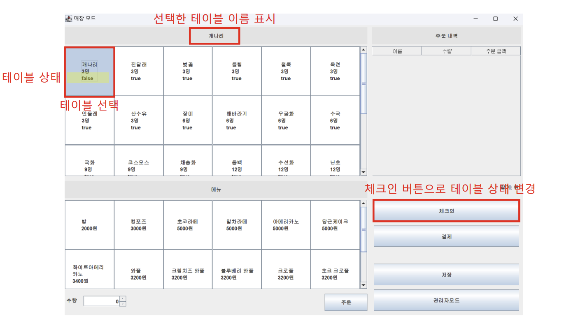
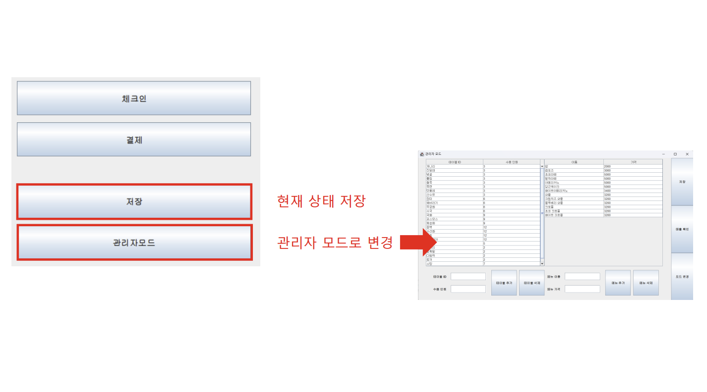
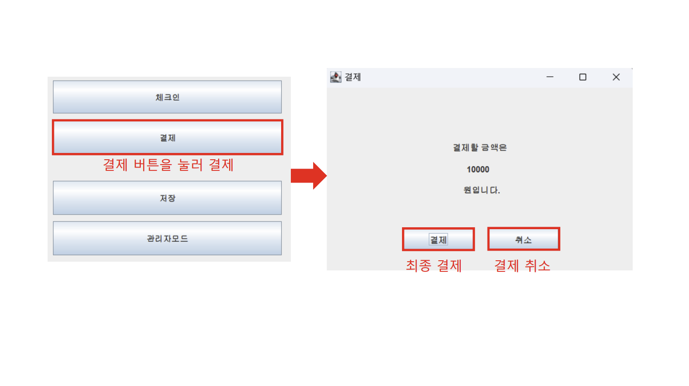
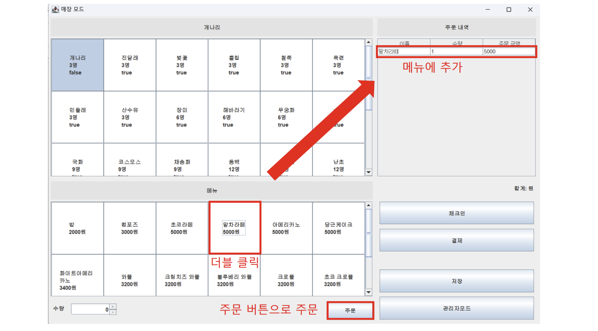

# Restaurant Management Program

Java 객체지향 프로그래밍 학습 프로젝트 (2023).  
레스토랑의 테이블 상태 관리, 주문 등록, 결제, 관리자 모드를 제공하는 데스크톱 기반 관리 프로그램입니다.  
Eclipse 환경에서 개발하였으며, 클래스 간 역할 분리와 OOP 설계를 중점적으로 적용했습니다.

---

## 주요 기능
- **테이블 관리**
  - 테이블 선택 → 상태(사용 가능/불가능) 확인
  - 체크인 버튼으로 상태 변경 가능
- **주문 관리**
  - 메뉴 더블 클릭 시 주문 내역에 추가
  - 수량, 금액 계산 후 주문 가능
- **결제**
  - 선택된 테이블의 주문 내역을 기반으로 결제 진행
  - 결제/취소 버튼 제공
- **데이터 저장**
  - 현재 상태를 `restaurant.dat` 파일에 저장 및 불러오기
- **관리자 모드**
  - 메뉴 추가, 수정, 삭제
  - 전체 매출 내역 조회 가능

---

## 사용 기술
- **언어:** Java  
- **IDE:** Eclipse  
- **구조:** 객체지향 설계 (OOP, SOLID 일부 원칙 적용)  
- **데이터:** File I/O (`restaurant.dat`)  

---

## 실행 화면

  
  

  
  

---

## 역할 및 배운 점
- 객체지향적 설계를 통해 클래스 간 역할 분리 경험  
- GUI와 비즈니스 로직을 분리하여 유지보수성 확보  
- File I/O를 이용한 데이터 저장/불러오기 기능 구현  
- 사용자 관점에서 프로그램 흐름을 설계하는 경험을 통해,  
  추후 실제 서비스 개발 시에도 구조적 사고와 확장 가능성 고려의 중요성을 알게 됨

---

## 실행 방법
1. Eclipse에서 프로젝트 Import
2. `Main.java` 실행  
3. GUI를 통해 테이블 선택 → 주문/결제/관리자 기능 활용 가능
